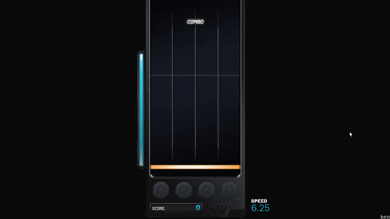

# rhythmaticc

Rhythmaticc is a game in a part of a dissertation about rhythm game level generation based on pre-composed music. The game has Mania-style mechanic that players have to press the falling objects in time with the music. More accurate players press, more score they get. The game is compatible with Windows only.

## Features
- Mania-style gameplay
- 4 Keys or 6 Keys mode
- You can play any songs you like (mp3, wav, flac, m4a, aiff, ogg, aac).
- Planned to be skinnable
- Modifiable key binding
- Audio/Video calibration

## Known Issues
- The mouse cursor is changed to Busy in-game. Alt-Tab back and forth should fix.
- Some falling objects can be seen underneath the play area.

## Building notes
- The audio analysis script requires Python 3.7 with [madmom](https://github.com/CPJKU/madmom) library and was built into a executable standalone file as analyse.exe.
- The source code of audio analysis script is in [AudioAnalysisPart](/AudioAnalysisPart) folder.
- FFmpeg library (both dll and exe files) is required and is NOT bundled in this git repository.
- Also, skin assets is NOT bundled in this git repository as well.
